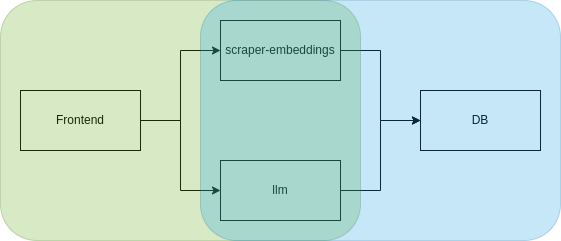

# 🧠 LLM Chat Web App with Embeddings & ChromaDB

This project is a microservices-based web application that allows you to:

- 🕸️ Scrape and parse website content

- 📝 Convert it into Markdown

- 🧬 Generate vector embeddings using OpenAI

- 🧠 Store them in ChromaDB

- 💬 Query them using an LLM (OpenAI or Gemini)

- 🖥️ Interact via a simple frontend

---

## 📦 Services Overview

| Service              | Description                                                                 |
|----------------------|-----------------------------------------------------------------------------|
| `scraper-embeddings` | Scrapes website content into markdown, generates embeddings with OpenAI     |
| `chroma-db`          | Vector store using ChromaDB with persistent volume                          |
| `llm`                | Backend API that processes queries and enhances responses using Gemini      |
| `frontend`           | Web interface to interact with the chat system                              |

---

## 📊 Architecture Diagram



---

## 🚀 Getting Started

### 1. Clone the repository

```bash
git clone https://github.com/your-user/llm-chat-app.git
cd llm-chat-app
```

### 2. Setup Environment Variables
Create a .env file at the root of the project with the following content:

```bash
OPENAI_API_KEY=your_openai_key
GEMINI_API_KEY=your_gemini_key
ANONYMIZED_TELEMETRY=FALSE
```
    ⚠️ Make sure these variables are accessible by Docker Compose when running the containers.

Alternatively, you can export them manually:

```bash
export OPENAI_API_KEY=your_openai_key
export GEMINI_API_KEY=your_gemini_key
```

### 3. Run the App
Make sure Docker is running, then launch everything:

```bash
docker compose up --build
```

This will spin up:
- ChromaDB on `http://localhost:8000`
- Scraper/Embedding API on `http://localhost:8080`
- LLM API on `http://localhost:5050`
- Frontend on `http://localhost:3000`

---

## 📚 Adding Dictionary Data
You can enrich LLM responses with additional structured context using a dictionary file:

- Place your custom dictionary.json inside llm/data/

- This file should contain extra definitions, acronyms, or reference data

- The LLM backend will use this during the query process to improve accuracy and context

---

## 📂 Folder Structure

```bash
.
├── LICENSE
├── README.md
├── assets/
│   └── llm-chat.png
├── compose.yml
├── embeddings/
│   ├── Dockerfile
│   ├── app.py
│   ├── requirements.txt
│   └── utils/
│       ├── createEmbeddingsDB.py
│       ├── extractWebInfo.py
│       └── scraper.py
├── frontend/
│   ├── Dockerfile
│   ├── app.js
│   ├── index.html
│   └── style.css
└── llm/
    ├── Dockerfile
    ├── app.py
    ├── data/
    │   ├── dictionary.json
    │   └── config.json
    ├── requirements.txt
    └── utils/
        └── llm.py
```

---

## 🛠️ Tips & Troubleshooting
- ✅ Make sure .env is not accidentally ignored or overwritten

- 🔄 Restart containers if you change .env or environment variables

- 📁 Embeddings are saved inside the ChromaDB persistent volume under ./chromadb/

---

## 📘 License
GNU GENERAL PUBLIC License — see LICENSE for details.